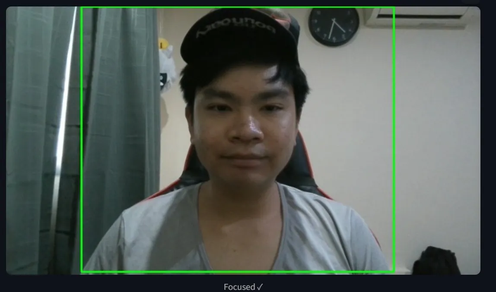
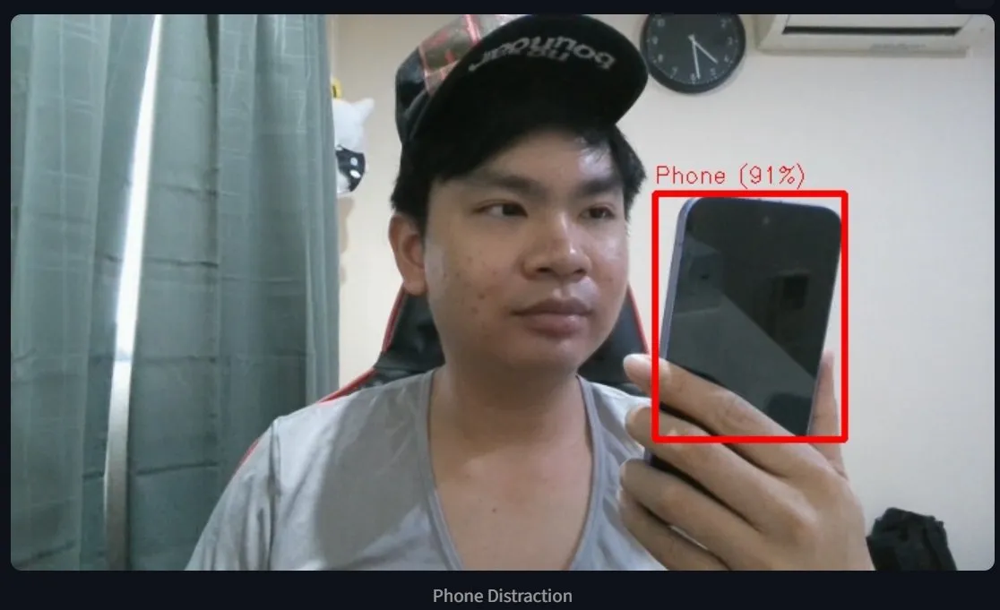
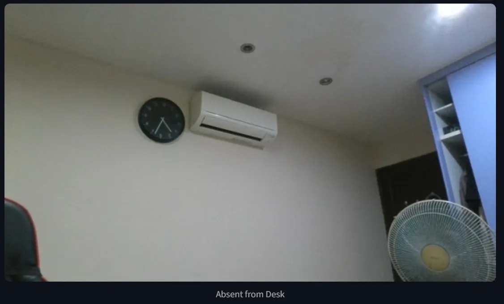

# 🎯 Sentinel AI — Deep Work Monitor

A real-time productivity monitor powered by Computer Vision. Sentinel AI uses YOLOv8 to detect distractions during work sessions and calculates a live **Focus Score** to help you stay accountable.

**[🚀 Live Demo](https://popolome-sentinel-ai.streamlit.app)**

---

## 📸 What It Does

Sentinel AI monitors your desk via webcam and detects three types of distractions in real time:

| Distraction | Trigger |
|---|---|
| 📱 Phone Usage | Cell phone detected in frame |
| 🪑 Absent from Desk | No person detected |
| 👥 Social Distraction | More than one person in frame |

At the end of each session, a **Focus Score** is calculated:

$$Focus Score = \left(\frac{Total Time - Distracted Time}{Total Time}\right) \times 100$$

---

## 🛠️ Tech Stack

| Layer | Technology |
|---|---|
| Object Detection | YOLOv8 Small (Ultralytics) |
| Computer Vision | OpenCV |
| Dashboard UI | Streamlit |
| Session Storage | SQLite |
| Deployment | Streamlit Community Cloud |

---

## ✨ Features

- **Multi-class distraction detection** — phone, absence, and social distractions tracked separately
- **Live Focus Score** — updates in real time with color-coded indicator (green / orange / red)
- **Distraction breakdown** — per-category second-by-second counters
- **Session persistence** — all sessions saved to SQLite with history chart
- **Cloud deployed** — accessible from any device with a browser and webcam

---

## 🧪 Detection Tests

Real-world test results captured from the live deployed app:

### Test 1 — Focused ✓


### Test 2 — Phone Distraction


### Test 3 — Absent from Desk


### App Dashboard 1


### App Dashboard 2


---

## 🗂️ Project Structure

```
sentinel-ai/
├── app.py           # Streamlit UI and session logic
├── detection.py     # YOLOv8 inference and distraction classification
├── database.py      # SQLite session persistence
└── requirements.txt # Dependencies
```

---

## 🚀 Run Locally

```bash
git clone https://github.com/popolome/Sentinel-AI.git
cd Sentinel-AI
pip install -r requirements.txt
streamlit run app.py
```

---

## 💡 Design Decisions

**Why YOLOv8 Nano?** Optimised for CPU inference with minimal latency — no GPU required, making it suitable for cloud deployment.

**Why Streamlit `st.camera_input`?** Unlike a raw video stream, snapshot-based inference is cloud-compatible and works across devices without browser security restrictions.

**Why SQLite?** Zero-config persistent storage appropriate for a single-user productivity tool. No external database setup required.

---

## 🔮 Future Improvements

- [ ] Replace SQLite with cloud DB (Supabase) for true multi-session persistence
- [ ] Add posture detection (MediaPipe)
- [ ] Weekly focus report export (PDF)
- [ ] Custom distraction categories
- [ ] Improve phone detection for rear-facing camera angles (fine-tune on custom dataset)

---

## 🧠 What I Learnt

- How to structure a modular Computer Vision pipeline across separate files (`detection.py`, `database.py`, `app.py`) rather than a single monolithic script
- How `st.session_state` works in Streamlit to persist data across reruns — a fundamental pattern for building stateful apps
- The difference between **local** and **cloud** deployment constraints — specifically how `st.camera_input` snapshot mode solves the browser security limitation of streaming webcam feeds in a cloud environment
- How to tune YOLO confidence thresholds differently per class (phone vs person) based on object size and occlusion characteristics
- How to design a **priority-based classification system** where multiple detections resolve to a single status (phone > absent > social > focused)
- SQLite as a lightweight persistence layer — appropriate tool choice for single-user applications without external DB overhead

---

## 👤 Author

**Mak Jun Kit**
[LinkedIn](https://www.linkedin.com/in/jun-kit-mak-611b4b108/) • [GitHub](https://github.com/popolome)
